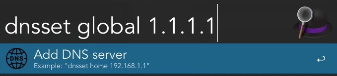
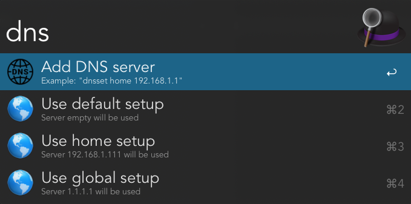

# Alfred workflow for DNS switching

2 actions are possible

## Creation of the new DNS config

`dnssset X Y` will create and store setting to use server `Y` when config `X` is requested

## Activate existing configuration

`dns X` will activate the DNS configuration with name X

